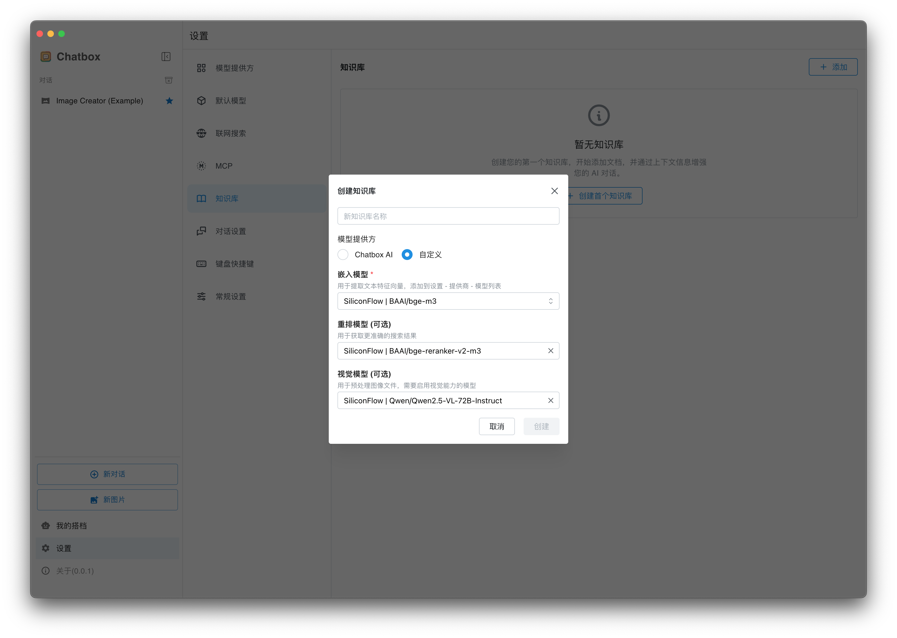
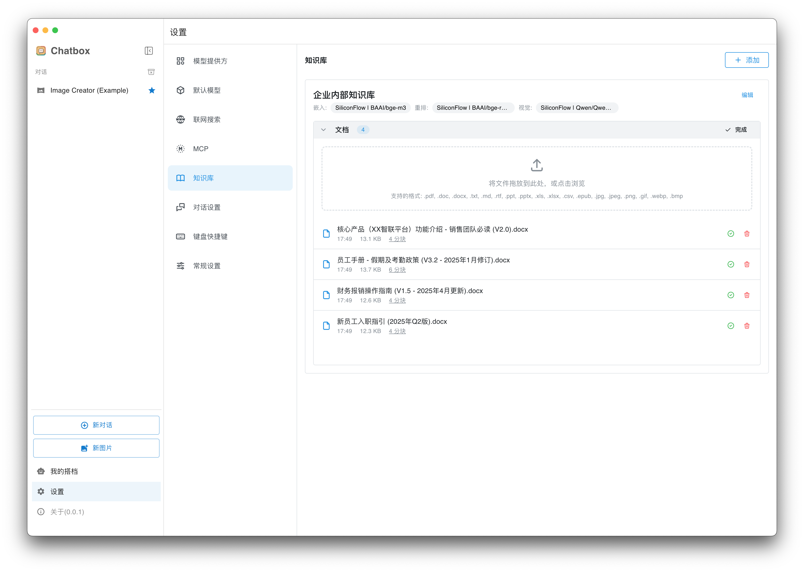
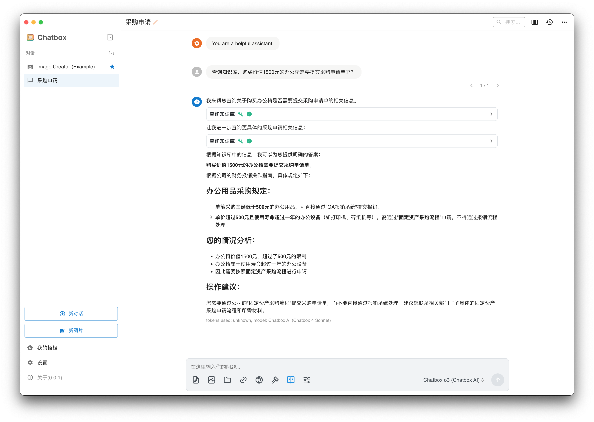

# Local Knowledge Base Tutorial

Chatbox version 1.15 introduced the local knowledge base feature. Users can create knowledge bases in settings and import documents. After documents are successfully imported, you can select the knowledge base in the conversation interface for Q&A. Below is the detailed usage process.

### Creating a Knowledge Base

Go to **Settings - Knowledge Base** page, click Create Knowledge Base, enter the knowledge base name, and select the models required for the knowledge base.

For Chatbox AI paid users, you can choose Chatbox AI as the model provider for the knowledge base. Free users can also use their own API.

**Embedding Model:** Used to convert documents into vectors

**Rerank Model:** Optional. When configured, you can get more accurate search results, which helps improve answer quality

**Vision Model:** Optional. When configured, you can add images to the knowledge base, and text in images will be extracted and indexed

<figure><figcaption>
Create Knowledge Base
</figcaption></figure>

### Adding Documents to the Knowledge Base

Drag in or click to browse files, wait for file processing to complete.


Due to local parsing limitations, some files may fail to parse, such as PDFs with complex content layouts. In such cases, you can use other professional software to extract PDF content to text files, or you can ignore the failure and continue importing other files.


<figure><figcaption>
Add Files
</figcaption></figure>

### Querying the Knowledge Base

Create a new conversation, select the knowledge base you just created from the toolbar in the input box

<figure><figcaption>
Select Knowledge Base
</figcaption></figure>

Then you can ask questions freely

<figure><figcaption></figcaption></figure>
