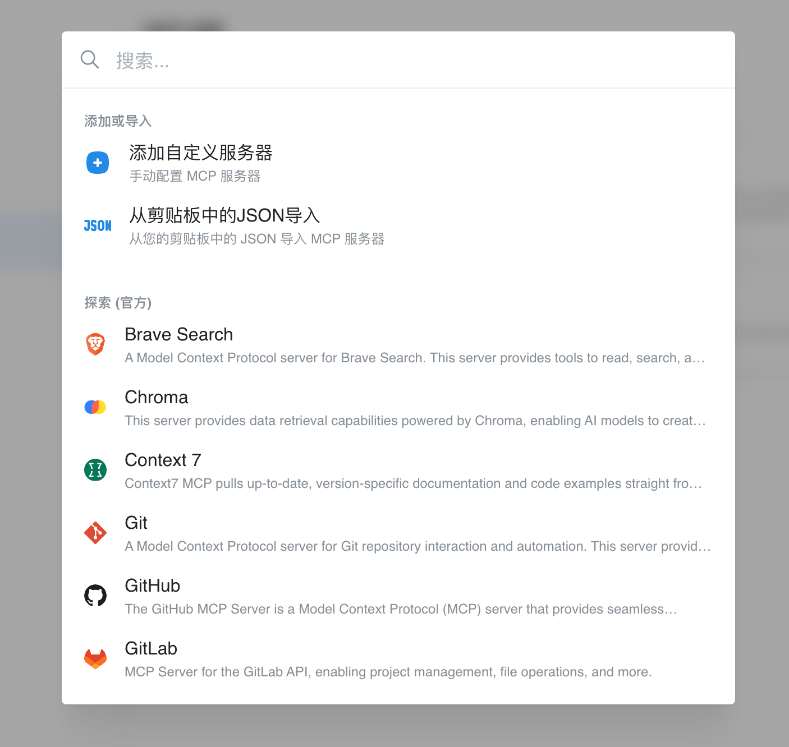
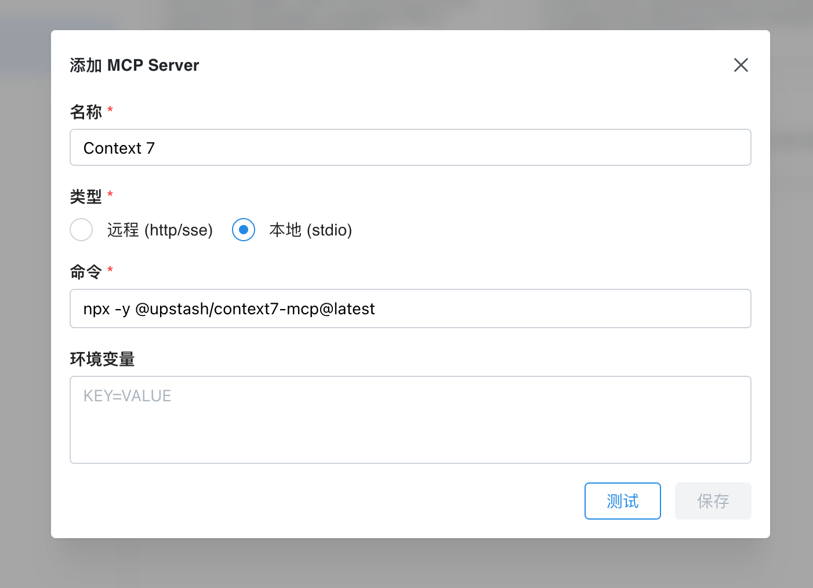

````markdown
---
icon: code
---

# MCP Tutorial

Chatbox version 1.14 introduced MCP support. Users can configure MCP services in settings and then intelligently call MCP tools in conversations.

## Configuring MCP Service

Go to **Settings - MCP** page, click "Add Server" to manually configure an MCP server, or select a built-in MCP service from the list.

<figure><figcaption></figcaption></figure>

<figure><figcaption></figcaption></figure>

## MCP One-Click Installation Link

Chatbox supports one-click MCP service installation via deep link. Users can click a link on your website to launch Chatbox and automatically configure the MCP service.

The link format is as follows:

```
chatbox://mcp/install?server=$BASE64_ENCODED_CONFIG
```

Where `$BASE64_ENCODED_CONFIG` is the base64-encoded MCP service configuration in the following format:

```
{
  "name": "fetch",
  "command": "npx",
  "args": ["fetch-mcp"],
  "env": {}
}
```

Or

```
{
  "name": "deepwiki",
  "url": "https://mcp.deepwiki.com/mcp"
}
```

### Generating One-Click Installation Link

- Write the JSON configuration for the MCP service
- Use `JSON.stringify` on the configuration, then base64 encode it
- Append the encoded string to `chatbox://mcp/install?server=`
````
