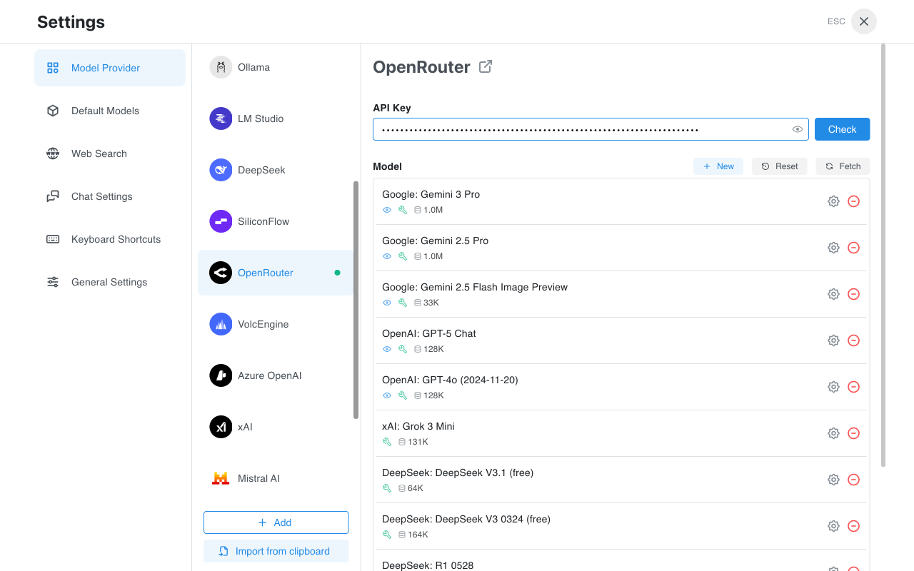

# How to Configure OpenRouter in Chatbox

OpenRouter is a unified AI model gateway that provides access to various leading large language models, including GPT-4, Claude, Gemini, Llama, Mistral, and more. With OpenRouter, you can use a single API key to access hundreds of models from different providers without registering for multiple services separately.

Advantages of using OpenRouter:

* Single API access to multiple model providers
* Flexible pay-as-you-go pricing
* Support for both open-source and proprietary models
* Some free models available for testing

This tutorial will guide you through configuring OpenRouter in Chatbox.

### Get Your OpenRouter API Key

1. Visit the [OpenRouter website](https://openrouter.ai/)
2. Sign up and log in to your account
3. Go to the [API Keys](https://openrouter.ai/keys) page
4. Click "Create Key" to generate a new API key
5. Copy the generated key (format: `sk-or-v1-...`)

### Configure OpenRouter in Chatbox

1. Open Chatbox. On first launch, you'll see a welcome screen - click "Setup Provider" to enter settings. If not the first launch, click the "Settings" button at the bottom of the sidebar.

<figure><figcaption>
Chatbox Welcome Screen
</figcaption></figure>

2. In the Model Provider list on the settings page, find and click "OpenRouter".

<figure><figcaption>
Model Provider List
</figcaption></figure>

3. On the OpenRouter configuration page, enter your API key in the "API Key" input field.

<figure><figcaption>
OpenRouter Configuration Page
</figcaption></figure>

4. Click the "Check" button to verify that your API key is valid. If successful, you'll see a confirmation message.

5. In the model list, you can see the various models available through OpenRouter. Click the "Fetch" button to refresh and get the latest model list.

6. Close the settings window and return to the main interface. Click "Select Model" at the bottom, and you can now choose from OpenRouter's models to start a conversation.

### Available Models

OpenRouter provides a rich selection of models, including but not limited to:

* **GPT Series**: GPT-4o, GPT-4o mini, GPT-5, etc.
* **Claude Series**: Claude 3.5 Sonnet, Claude 3 Opus, etc.
* **Gemini Series**: Gemini 2.5 Pro, Gemini 2.5 Flash, etc.
* **Open Source Models**: DeepSeek, Llama, Mistral, Qwen, etc.
* **Free Models**: Some models offer free usage quotas

### FAQ

#### API Key Format

OpenRouter API keys typically start with `sk-or-v1-`. Make sure to copy the complete key.

#### Pricing

OpenRouter uses a pay-as-you-go pricing model, with different prices for different models. You can check the specific pricing for each model on the OpenRouter website. Some models (marked as "free") offer free usage quotas.

#### Connection Issues

If you encounter connection issues, please check:
* Whether the API key is entered correctly
* Whether your network connection is working properly
* If using from mainland China, you may need to configure a network proxy

### References

* [OpenRouter Website](https://openrouter.ai/)
* [OpenRouter Documentation](https://openrouter.ai/docs)
* [OpenRouter Model List](https://openrouter.ai/models)
* [OpenRouter Pricing](https://openrouter.ai/models)
