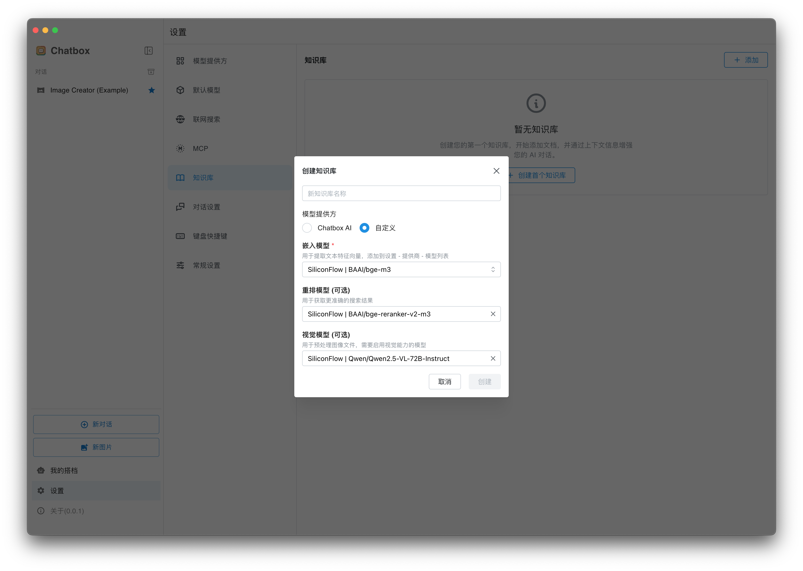
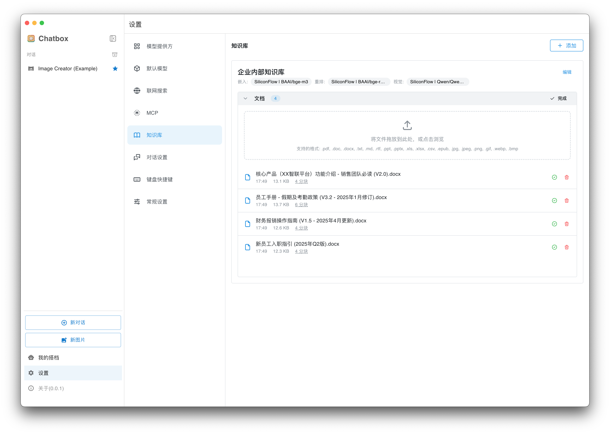
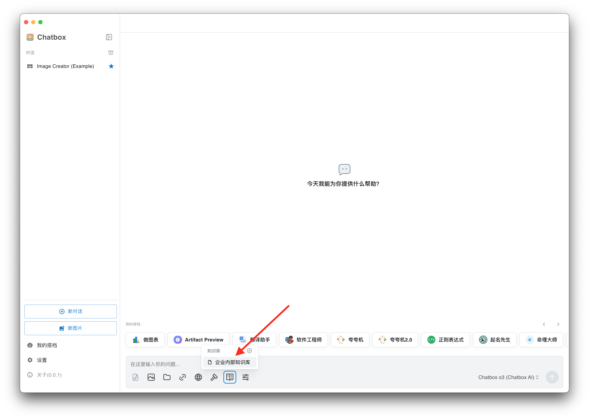
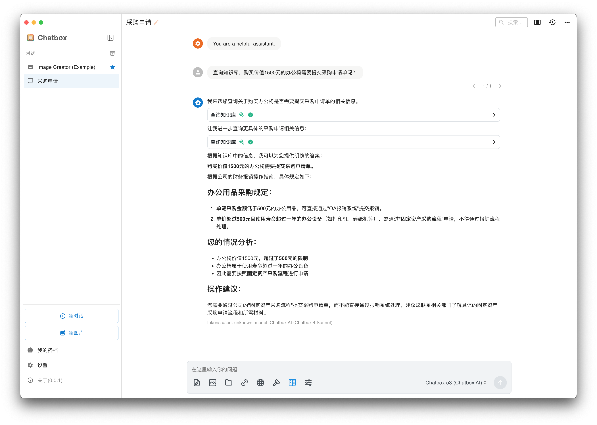

# 本地知识库教程

Chatbox 1.15 版本推出本地知识库功能，用户可以在设置里创建知识库并导入文档，待文档录入成功后，可以在对话界面选择知识库进行问答，下面介绍具体使用方法流程。

### 创建知识库

进入**设置 - 知识库** 页面，点击创建知识库，输入知识库名称，并选择知识库所需要的模型

对于 Chatbox AI 付费用户，可以选择 Chatbox AI 作为知识库的模型提供方，免费用户也可以选择自己的API。

**嵌入模型：**&#x7528;来将文档转换为向量

**重排模型：**&#x53EF;选，配置后可以获得更准确的搜索结果，对回答质量有一定帮助

**视觉模型：**&#x53EF;选，配置之后，可以往知识库里添加图片，图片中的文字会被提出来入库

<figure><figcaption>
创建知识库
</figcaption></figure>

### 往知识库添加文档

拖入或点击浏览文件，等待文件处理完成。


由于本地解析的限制，部分文件可能解析失败，比如内容排版复杂的pdf。遇到这种情况可以用其他专业软件来提取pdf为文本文件，也可以先忽略，继续导入其他文件。


<figure><figcaption>
添加文件
</figcaption></figure>

### 对知识库进行问答

创建新对话，在输入框里的工具栏选择刚刚创建的知识库

<figure><figcaption>
选择知识库
</figcaption></figure>

然后就可以随意问答了

<figure><figcaption></figcaption></figure>
