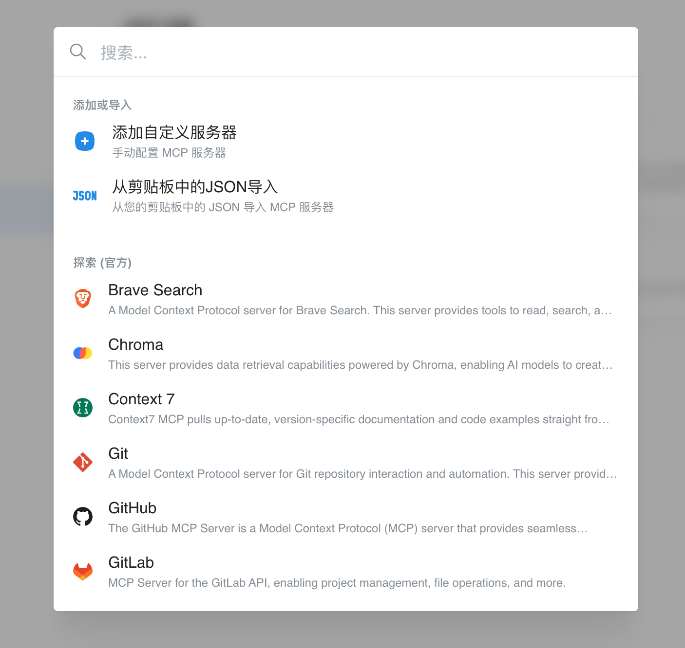
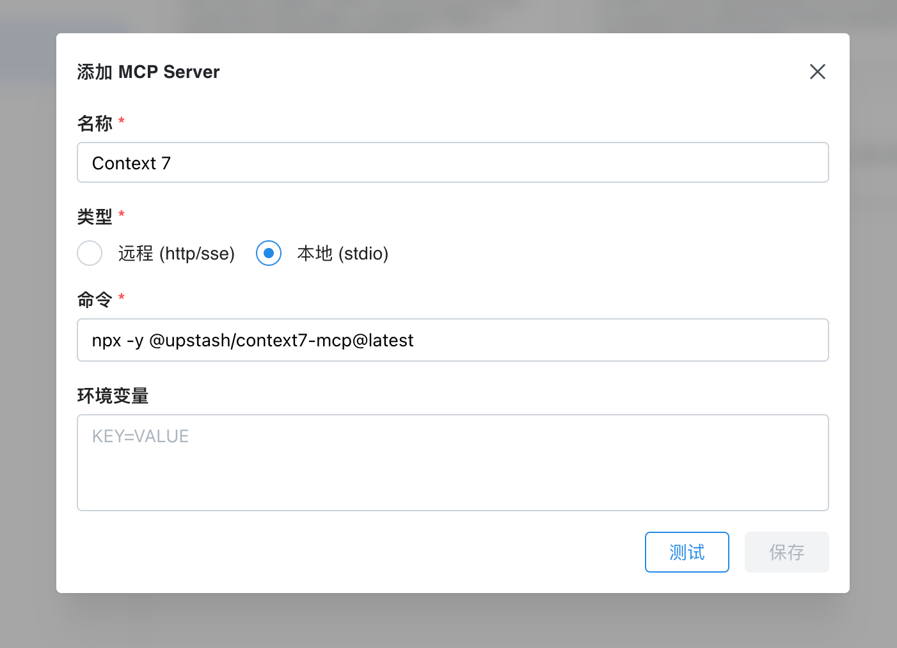

# MCP教程

Chatbox 1.14版本推出MCP支持，用户可以在设置里配置MCP服务，然后就可以在对话中智能调用MCP工具了。

## 配置MCP服务

进入**设置 - MCP** 页面，点击“添加服务器”，即可手动配置MCP服务器，或从列表中选择内置的MCP服务。

<figure><figcaption></figcaption></figure>

<figure><figcaption></figcaption></figure>

## MCP一键安装链接

Chatbox支持通过deep link一键安装MCP服务，用户可以在您的网站上点击链接，启动Chatbox并自动配置MCP服务。

链接格式如下：

```
chatbox://mcp/install?server=$BASE64_ENCODED_CONFIG
```

其中，`$BASE64_ENCODED_CONFIG`是base64编码的MCP服务的配置信息，格式如下：

```
{
  "name": "fetch",
  "command": "npx",
  "args": ["fetch-mcp"],
  "env": {}
}
```

或

```
{
  "name": "deepwiki",
  "url": "https://mcp.deepwiki.com/mcp"
}
```

### 生成一键安装链接

- 编写MCP服务的JSON配置
- `JSON.stringify`配置后，使用base64编码
- 将编码后的字符串拼接到`chatbox://mcp/install?server=`后面