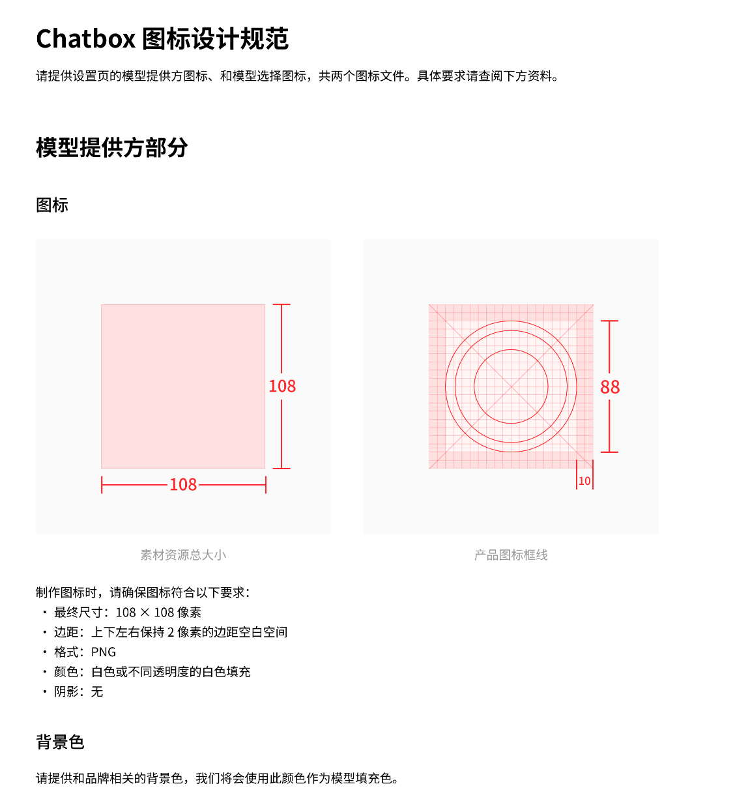

# 导入第三方提供方配置

从版本**1.15.1**开始，Chatbox支持导入JSON格式的模型提供方配置，部分提供方官网上会提供配置，可以手动复制后在Chatbox软件中一键导入，也支持通过deep link一键导入到客户端。

参考支持的提供方：

* [302.AI](https://help.302.ai/docs/jie-ru-dao-ChatBox)

#### 配置格式

```typescript
type ProviderConfig = {
  id: string // 提供方id，需要在 Chatbox 内唯一，建议用域名
  name: string // 提供方在 Chatbox 内展示名称
  type: 'openai' // 目前仅支持openai规范的API，未来会支持更多API类型
  iconUrl: string // icon 规格要求见下方图标规范
  urls: {
      website: string // 提供方官网链接，如 https://chatboxai.app
      getApiKey?: string // 可选：提供方获取API key的地址
      docs?: string // 可选：提供方文档地址
      models?: string // 可选：提供方查看模型列表的页面地址
  }
  settings: {
    apiHost: string // 提供方的 API host，如 https://api.openai.com
    apiPath?: string // 提供方的 API Path，默认为 /v1/chat/completions
    apiKey?: string // 用户专属的 API key, 也可以导入后用户在界面自行填写
    models: ModelInfo[] // 导入后默认展示的模型列表，建议放一些最常用的
  } 
}

type ModelInfo = {
  modelId: string // 模型的id，如gpt-4o
  nickname?: string // 模型的显示名称，默认为模型的id
  type?: 'chat' | 'embedding' | 'rerank' // 模型的类型，默认为chat
  capabilities?: ('vision' | 'reasoning' | 'tool_use')[] // 模型的能力，决定了 Chatbox 如何调用这些模型
  contextWindow?: number // 模型的最大上下文限制，Chatbox 会以此来计算用户输入限制
  maxOutput?: number // 模型的最大输出限制，Chatbox 会限制请求参数不超过这个值，留空则不会限制
}

```

#### 示例配置

```json
{
  "id": "openai",
  "name": "OpenAI",
  "type": "openai",
  "iconUrl": "https://openai.com/favicon.ico",
  "urls": { "website": "https://openai.com" },
  "settings": {
    "apiHost": "https://api.openai.com/",
    "models": [
      {
        "modelId": "gpt-4o",
        "nickname": "GPT 4o",
        "type": "chat",
        "capabilities": ["vision", "tool_use"],
        "contextWindow": 128000,
        "maxOutput": 16384
      },
      {
        "modelId": "text-embedding-3-small",
        "type": "embedding"
      }
    ]
  }
}

```

#### deep link格式

```
chatbox://provider/import?config=$BASE64_ENCODED_CONFIG
```

其中`BASE64_ENCODED_CONFIG`是上面的json配置经过base64编码后的字符串

#### 提供方图标规范

<figure><figcaption></figcaption></figure>
