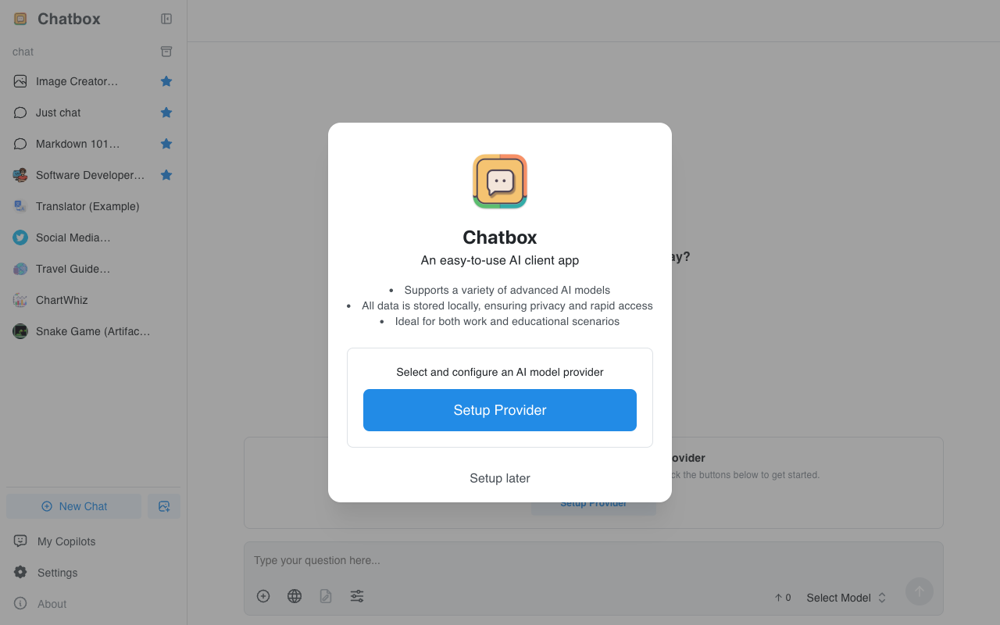
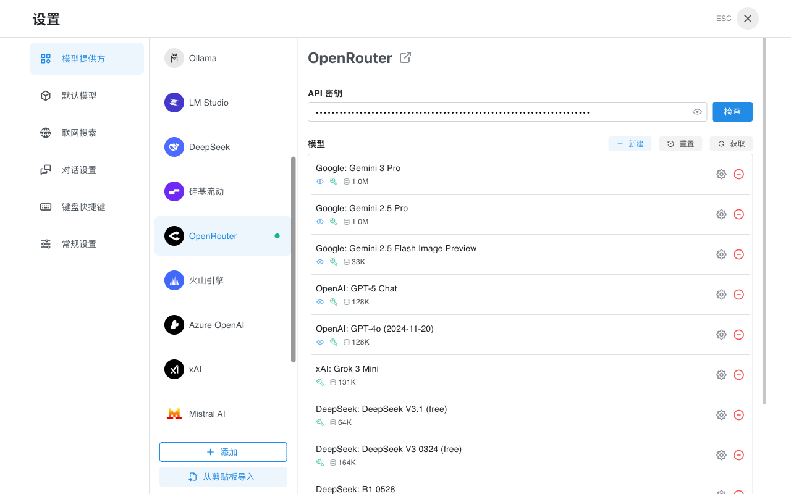

# 如何在 Chatbox 中配置 OpenRouter

OpenRouter 是一个统一的 AI 模型网关，提供对多种主流大语言模型的访问，包括 GPT-4、Claude、Gemini、Llama、Mistral 等。通过 OpenRouter，你可以使用单一的 API 密钥访问来自不同提供商的数百个模型，无需分别注册多个服务。

使用 OpenRouter 的优势：

* 单一 API 访问多家模型提供商
* 灵活的按量付费模式
* 支持多种开源和闭源模型
* 提供部分免费模型可供测试

本教程将指导你如何在 Chatbox 中配置 OpenRouter。

### 获取 OpenRouter API 密钥

1. 访问 [OpenRouter 官网](https://openrouter.ai/)
2. 注册并登录账户
3. 进入 [API Keys](https://openrouter.ai/keys) 页面
4. 点击 "Create Key" 创建新的 API 密钥
5. 复制生成的密钥（格式类似：`sk-or-v1-...`）

### 在 Chatbox 中配置 OpenRouter

1. 打开 Chatbox，首次启动会显示欢迎界面，点击"设置提供方"进入设置页面。如果不是首次启动，点击侧边栏底部的"设置"按钮。

<figure><figcaption>
Chatbox 首页
</figcaption></figure>

2. 在设置页面的模型提供方列表中，找到并点击 "OpenRouter"。

<figure><figcaption>
模型提供方列表
</figcaption></figure>

3. 在 OpenRouter 配置页面，将你获取的 API 密钥填入"API 密钥"输入框中。

<figure><figcaption>
OpenRouter 配置页面
</figcaption></figure>

4. 点击"检查"按钮验证 API 密钥是否有效。如果验证成功，你将看到成功提示。

5. 在模型列表中，你可以看到 OpenRouter 提供的各种模型。点击"获取"按钮可以刷新获取最新的模型列表。

6. 关闭设置窗口，回到主界面。点击底部的"选择模型"，你现在可以选择 OpenRouter 提供的模型开始对话了。

### 可用模型

OpenRouter 提供了丰富的模型选择，包括但不限于：

* **GPT 系列**：GPT-4o、GPT-4o mini、GPT-5 等
* **Claude 系列**：Claude 3.5 Sonnet、Claude 3 Opus 等
* **Gemini 系列**：Gemini 2.5 Pro、Gemini 2.5 Flash 等
* **开源模型**：DeepSeek、Llama、Mistral、Qwen 等
* **免费模型**：部分模型提供免费使用额度

### 常见问题

#### API 密钥格式

OpenRouter 的 API 密钥格式通常为 `sk-or-v1-` 开头的字符串。请确保复制完整的密钥。

#### 计费说明

OpenRouter 采用按量付费模式，不同模型的价格不同。你可以在 OpenRouter 官网查看各模型的具体定价。部分模型（如标注为 "free" 的模型）提供免费使用额度。

#### 连接问题

如果遇到连接问题，请检查：
* API 密钥是否正确输入
* 网络连接是否正常
* 如果在中国大陆使用，可能需要配置网络代理

### 参考链接

* [OpenRouter 官网](https://openrouter.ai/)
* [OpenRouter 文档](https://openrouter.ai/docs)
* [OpenRouter 模型列表](https://openrouter.ai/models)
* [OpenRouter 定价](https://openrouter.ai/models)
